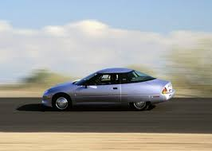
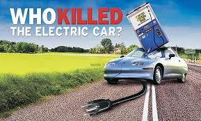

## [Tesla Inc.,](https://en.wikipedia.org/wiki/Tesla,_Inc.)

## Table of Contents

- [Overview and Origin](#overview-and-origin)
- [Business Activities](#business-activities)
- [Tesla Career](#tesla-career)
- [Landscape](#landscape)
- [Tesla Performance](#tesla-performance)
- [Results](#results)
- [Recommendations](#recommendations)

## Overview and Origin

Tesla Inc., originally named Tesla Motors, rebranded to Tesla Inc. in February 2017 to reflect its broader scope beyond just automobiles. Founded in 2003 by Martin Eberhard and Marc Tarpenning in San Jose, CA, Tesla has since grown into a leader in sustainable energy and innovative technology.

    
Elon Musk, co-founder of Tesla, leveraged his wealth accumulated from [PayPal](https://www.paypal.com) to become a principal investor and was appointed Chief Executive Officer in 2008. The company is named after [Nikola Tesla](https://en.wikipedia.org/wiki/Nikola_Tesla), the visionary inventor renowned for his groundbreaking work with alternating current (AC).

Tesla is a publicly traded company on the NASDAQ stock exchange, listed under the ticker symbol [TSLA](https://www.nasdaq.com/market-activity/stocks/tsla). As of August 7th, 2024, the stock price stands at $201.81 per share, with a market capitalization of approximately 644 billion dollars.

The founders of Tesla were deeply concerned about global warming and the harmful pollutants emitted by internal combustion engines (ICE). Moreover, the termination and recall of all EV1 cars by General Motors served as a significant inspiration for the creation of Tesla Motors, driving their commitment to developing sustainable electric vehicles.

    

        The founders of Tesla were increasingly concerned about global warming and the pollutants generated by internal combustion engines (ICE). Additionally, the discontinuation and recall of all EV1 cars by General Motors served as a pivotal inspiration for the creation of Tesla Motors, fueling their mission to develop sustainable electric vehicles.
    

    

        
    

 

    

                
    

    

        There is an interesting and thought-provoking document entitled <br<em>Who Killed the Electric Car?</em>
    

   

Recently, Tesla has created Tesla Dojo, a supercomputer designed to use sophisticated machine learning (ML) and nural network algorithms to analyze video data and create models for the company's vision system utilized in the Full Self-Driving (FSD - Supervised), a feature of their cars. This advanced vision system is also employed by the Tesla Bot, also known as Optimus.

**Tesla Bot (Optimus)**

     

## Business Activities

Elon Musk’s vision for Tesla centers on leveraging AI and machine learning (ML) to fundamentally transform transportation, making it both safer and more efficient. By harnessing these advanced technologies, Tesla aims to significantly enhance road safety and optimize the driving experience. Additionally, Tesla plans to incorporate this state-of-the-art vision system into Optimus, the Tesla Bot, thereby extending its innovative capabilities beyond vehicles to versatile robotic applications.

Tesla's performance is extremely strong, as evident in the [Tesla Q2 2024 shareholder report](https://digitalassets.tesla.com/tesla-contents/image/upload/IR/TSLA-Q2-2024-Update.pdf).

* The intended customers of Tesla's technology fall into two categories:

    * **General Consumers** - These are individuals looking to offload mundane tasks, whether through Tesla's Full Self-Driving (FSD) feature or the Tesla Bot performing household chores. According to an article in [Tesla Growth and Production Statistics: How Many Vehicles Are Sold Across the Globe?](https://www.investing.com/academy/statistics/tesla-facts/), almost 2 million Tesla cars have been sold. Additionally, various rumors suggest that the Tesla Bot (Optimus) could be released as soon as the end of 2025. Elon Musk posted on X, stating, ["My guess is, Optimus will be more valuable than the car, long-term."](https://x.com/TeslaAIBot/status/1555369390828359689)

    * **Producers** - Tesla, under the leadership of Elon Musk, is a strong advocate for open-source principles. In a bold move to accelerate the development of sustainable technology, Tesla has made all of its patents freely available for public use. This initiative encourages innovation and collaboration across the industry, allowing other companies and developers to build upon Tesla’s advancements. By sharing their technological breakthroughs, Tesla aims to foster a more sustainable future and drive the widespread adoption of electric vehicles and renewable energy solutions. Elon Musk’s philosophy is that the true measure of success is not the competition Tesla can outdo, but the impact it can make on the world’s transition to sustainable energy.

Tesla boasts an exceptionally large market capitalization, enabling the company to allocate substantial resources towards Research and Development (R&D). This financial strength gives Tesla a significant edge over its competitors, allowing for continuous innovation and rapid advancements in technology. By investing heavily in R&D, Tesla is able to push the boundaries of what is possible in the fields of electric vehicles, renewable energy, and artificial intelligence, maintaining its

* As mentioned previously, Tesla is creating such products as FSD chip and the Dojo chip which 

* Which technologies are they currently using, and how are they implementing them? (This may take a little bit of sleuthing&mdash;you may want to search the company’s engineering blog or use sites like Stackshare to find this information.)

## Tesla Career
Tesla [AI and Robotics](https://www.tesla.com/en_eu/AI) career website docuent some additional technolgies as well as career information. 

## Landscape
* Tesla originated in the electric car industry, but the key differentiator in their products is their extensive use of AI and machine learning (ML). By integrating advanced AI/ML technologies, Tesla not only enhances the performance and efficiency of their vehicles but also sets new standards in autonomous driving and smart energy solutions.
 
* There has been an explosion in the AI/ML industry, partially driven by OpenAI's ChatGPT and other models such as DALL-E, Copilot, and TutorMe. However, the field of AI/ML is not new. According to a webpage from Harvard, [The History of Artificial Intelligence](https://sitn.hms.harvard.edu/flash/2017/history-artificial-intelligence/), the roots of AI can be traced back to the mid-20th century.

* There are many compaines that utilize AI/ML enhance driving capabilites such as

    [Chevrolet - Super Crise](https://www.chevrolet.com/super-cruise)  

    [BMW - Driving Assistant Professional ](https://www.bmwgroup.com/en/news/general/2023/driver-assistance-systems.html)

    [Rivian - Driver+](https://rivian.com/support/article/is-rivian-driver-a-level-3-autonomous-driving-system)

## Results

Tesla's business impact is far-reaching, touching many areas:

1. **Automotive Industry**: Tesla has revolutionized the electric vehicle market with its autonomous driving technology.
2. **Energy Sector**: Tesla offers renewable energy solutions and grid services, including the Tesla Powerwall.
3. **Technology Innovation**: Tesla leads in battery technology and has established an extensive Supercharger network.
4. **Stock Market Influence**: Tesla's stock has seen significant growth, making it a major player in the market.
5. **Environmental Impact**: Tesla is committed to reducing emissions and promoting sustainable energy alternatives, significantly impacting the environment.

In my opinion, one of the core metrics for measuring success, especially in the area of AI/ML, is the number of accidents per mile driven while using Full Self-Driving (FSD) versus not using it. According to Tesla's [Q2 2024 Vehicle Safety Report](https://www.tesla.com/VehicleSafetyReport), Tesla vehicles using FSD had an accident rate of nearly 7 million miles driven per accident, compared to the national average of 500,000 miles driven per accident. This indicates that Tesla's FSD is approximately 14 times safer than the national average.

## Tesla Performance
Tesla [Q2 2024 shareholder report](https://digitalassets.tesla.com/tesla-contents/image/upload/IR/TSLA-Q2-2024-Update.pdf)

* How is your company performing relative to competitors in the same field?

## Recommendations

You may sense my high regard for Tesla as an innovative company at the cutting edge of AI/ML technology.

I recall watching the movie *I, Robot* starring Will Smith in 2004 and thinking that a robot like the ones depicted would not be possible in my lifetime. Looking at Tesla Bot, Optimus, I realize I was wrong. The strides companies like Tesla and Boston Dynamics have made in the field of robotics are nothing short of amazing.

If I were to work for Tesla, I would love to be involved with the Optimus program. A robot like Optimus has endless possibilities. I especially see Optimus helping the elderly and individuals with disabilities. The staggering number of computations a bipedal robot must perform just to walk, let alone perform other tasks, is mind-blowing.

I truly believe that this is coming, whether some people like it or not; they cannot stand in the way of progress.

My recommendations for Tesla would be to enhance Optimus with conversational skills, allowing it not only to help physically but also to provide companionship. I believe this would be beneficial both to the company, to increase the sales of Optimus, and to "humanize" it. With the resources Tesla has at their disposal, they could, in my opinion, surpass other conversational engines.

Besides utilizing the conversational engine in Optimus, it could also be used in Tesla vehicles, as well as other appliances. Imagine driving in the car and getting a verbal prompt about traffic, something of interest in the area, or even just to keep you amused.
